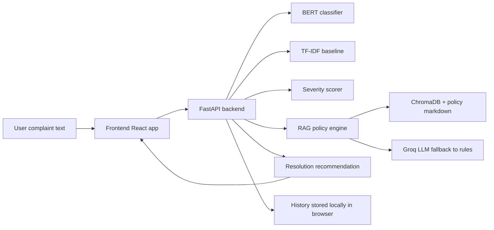

# Credit Card Dispute Resolution

An end-to-end credit card dispute assistant that classifies complaint text, scores severity, generates policy-grounded explanations, and suggests a resolution plan.

This project combines:

- A FastAPI backend with a fine-tuned BERT classifier, a TF-IDF baseline, rule-based severity scoring, and a RAG policy explainer.
- A React + Vite frontend for single-complaint analysis, batch file upload, a live model dashboard, generated dispute letters, and local history.
- CFPB-based datasets, dispute policy markdown files, notebooks that document the full ML pipeline, and test coverage for the enhanced frontend flow.

## What This Project Does

The app accepts a complaint written in plain language and turns it into a structured dispute workflow.

It can:

1. Classify the complaint into one of six dispute categories:
	 - Unauthorized Transaction
	 - Billing Error
	 - Duplicate Charge
	 - Goods Not Received
	 - Service Not Provided
	 - Merchant Fraud
2. Estimate severity from 0 to 10 using rule-based signals such as amount, urgency, repetition, and risk language.
3. Generate a short policy-grounded explanation using ChromaDB + Groq when available.
4. Recommend a resolution action, expected timeline, and supporting documents.
5. Generate a formal dispute letter that the user can edit, copy, or download.
6. Store analysis history locally in the browser so the user can revisit previous results.

## Repository Layout

```text
backend/      FastAPI API, inference code, RAG engine, severity scoring, and model assets
frontend/     React UI, history panel, PDF/TXT/CSV upload flow, and dashboard
datasets/     Raw, processed, labeled, and synthetic complaint datasets
docs/         Category definitions, mappings, schema notes, and workflow docs
notebooks/    Data prep, label creation, model training, RAG setup, and Colab backend notebook
policies/     One markdown policy file per dispute category
tests/        Automated checks for the enhanced frontend features
markdown/     High-level overview material
```

## Architecture

The system is built around a simple flow:



The backend can run from Colab during development, and the frontend can point to it through an API base URL.

## Frontend Features

The frontend has four main tabs:

- Analyze Dispute: enter a complaint, choose BERT or baseline, and run fast or full analysis.
- PDF Upload: upload a PDF, TXT, or CSV file and batch classify complaint chunks.
- Model Dashboard: inspect backend health, dataset stats, model comparison, RAG architecture, and tech stack.
- History: review previously analyzed complaints.

Additional frontend behavior:

- The app can generate a dispute letter from the latest result.
- History is stored in browser `localStorage` under `dispute_history` and capped at 50 items.
- Batch upload exports results as CSV.
- The frontend can be configured to talk to a backend URL through `VITE_API_BASE_URL`.

## Backend Features

The backend exposes the main analysis and support routes:

- `POST /predict` for fast classification.
- `POST /predict-full` for classification plus severity plus RAG explanation plus resolution.
- `GET /health` for model and runtime health.
- `GET /models` for loaded model information.
- `POST /batch-predict` for batch file analysis.

On startup, the backend:

- Loads local model assets when available.
- Uses `MODEL_BASE_PATH` to locate model files.
- Can download assets from Hugging Face if `MODEL_REPO_ID` is configured.
- Loads the ChromaDB policy index from the model asset directory.
- Falls back to rule-based explanations if Groq is unavailable.

## Datasets

The repository includes complaint data in several stages:

- `datasets/raw/` for the original CFPB export.
- `datasets/processed/` for cleaned and labeled versions.
- `datasets/labeled_complaints.csv` for the labeled master file.
- `datasets/synthetic/` for generated examples.

The dataset work is documented further in the notebooks and docs folder.

## Policy Knowledge Base

The `policies/` folder contains one markdown file per dispute category. These files are used as the policy source for the RAG engine.

The policies currently cover:

- Unauthorized Transaction
- Billing Error
- Duplicate Charge
- Goods Not Received
- Service Not Provided
- Merchant Fraud

## Notebooks

The notebooks tell the project story end to end:

1. `01_data_preparation.ipynb` - raw data cleanup and transformation.
2. `02_label_creation.ipynb` - label assignment and dataset preparation.
3. `03_baseline_model.ipynb` - TF-IDF + Logistic Regression baseline.
4. `04_bert_model.ipynb` - fine-tuned BERT model.
5. `05_rag_setup.ipynb` - policy index creation and RAG setup.
6. `run_backend_on_colab.ipynb` - backend execution from Colab.

## Requirements

Backend dependencies are listed in `requirements.txt` and `backend/requirements_backend.txt`.

The stack includes:

- FastAPI and Uvicorn
- Pydantic and python-multipart
- PyTorch and Transformers
- scikit-learn, joblib, numpy, pandas
- LangChain, ChromaDB, and Groq integration
- sentence-transformers for embeddings

Frontend dependencies are standard React + Vite packages.

## Environment Variables

Useful backend variables:

- `MODEL_BASE_PATH` - location of model artifacts.
- `MODEL_REPO_ID` - Hugging Face repo used to download model assets if local files are missing.
- `MODEL_REPO_REVISION` - model repo revision to fetch.
- `HUGGINGFACE_HUB_TOKEN` or `HF_TOKEN` - token for private model repos.
- `GROQ_API_KEY` - enables Groq-backed RAG explanations.

Useful frontend variables:

- `VITE_API_BASE_URL` - backend URL used by the browser app.

## How To Run

### 1. Run the backend

The backend is designed to run with the trained model assets already present in `backend/models/`.

If you are running the backend locally, start it from the project root or from the backend folder with Uvicorn, for example:

```bash
uvicorn backend.main:app --reload --port 8000
```

If you are running the backend from Colab, use the notebook provided in `notebooks/run_backend_on_colab.ipynb`.

### 2. Run the frontend

```bash
cd frontend
npm install
npm run dev
```

If the backend is not on the same origin, set `VITE_API_BASE_URL` before running the frontend.

### 3. Build the frontend

```bash
cd frontend
npm run build
```

## Working With History

History is intentionally lightweight and browser-local.

Each successful analysis saves a compact record containing:

- Timestamp
- Complaint preview
- Predicted category
- Confidence
- Severity details when available
- Model used
- Whether RAG was used

That data is saved in the browser only, not in the backend database.

## Project Notes

- The repository intentionally keeps the backend and frontend separate so they can be run independently.
- The dashboard is informational and reflects the current implementation, not future deployment plans.
- The project uses real CFPB complaint data plus generated supporting material to demonstrate the workflow.
- The frontend is now cleaned of personal identifiers and unimplemented deployment references.

## Testing

Run the frontend build as a quick sanity check:

```bash
cd frontend
npm run build
```

If you add more tests later, place them in `tests/` or the relevant app folder.

## Extending The Project

Good next enhancements would be:

- Persisting history on the backend instead of browser storage.
- Adding authentication if multiple users will share the app.
- Replacing local Colab runtime usage with a stable deployment target.
- Adding more automated tests around the batch upload and dispute letter flow.

